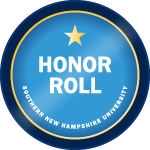
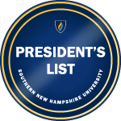

<!-- index.md -->

# Tammy Hartline's E-Portfolio

    <a href="/" style="background-color: #8B0000; color: white; padding: 10px 15px; text-decoration: none; border-radius: 5px;">Home</a>
    <a href="/intro" style="background-color: #8B0000; color: white; padding: 10px 15px; text-decoration: none; border-radius: 5px;">Introduction/About Me</a>
    <a href="/original-artifact-functionality" style="background-color: #8B0000; color: white; padding: 10px 15px; text-decoration: none; border-radius: 5px;">Original Artifacts Functionality</a>
    <a href="/enhancement-plan" style="background-color: #8B0000; color: white; padding: 10px 15px; text-decoration: none; border-radius: 5px;">Enhancement Plan</a>
    <a href="/software-engineering-and-design" style="background-color: #8B0000; color: white; padding: 10px 15px; text-decoration: none; border-radius: 5px;">Software Engineering/Design</a>
    <a href="/algorithms-and-data-structures" style="background-color: #8B0000; color: white; padding: 10px 15px; text-decoration: none; border-radius: 5px;">Algorithms and Data Structures</a>
    <a href="/databases" style="background-color: #8B0000; color: white; padding: 10px 15px; text-decoration: none; border-radius: 5px;">Databases</a>
    <a href="/code-review" style="background-color: #8B0000; color: white; padding: 10px 15px; text-decoration: none; border-radius: 5px;">Code Review</a>
    <a href="/final-enhancements-review-summary" style="background-color: #8B0000; color: white; padding: 10px 15px; text-decoration: none; border-radius: 5px;">Final Enhancements Review Summary</a>
    <a href="/program_instructions" style="background-color: #8B0000; color: white; padding: 10px 15px; text-decoration: none; border-radius: 5px;">Enhanced Program - Run Instructions</a>
    <a href="/career-objective" style="background-color: #8B0000; color: white; padding: 10px 15px; text-decoration: none; border-radius: 5px;">Career Objective: Machine Learning Architect</a>
    <a href="/site-and-repo-links" style="background-color: #8B0000; color: white; padding: 10px 15px; text-decoration: none; border-radius: 5px;">Site & Repository Links</a>

---

#### Table of Contents

- [Home](/index.md/)
- [Introduction/About Me](/intro.md/)
- [Original Artifacts Functionality](/original-artifact-functionality.md/)
- [Enhancement Plan](/enhancement-plan.md/)
- [Software Engineering/Design](/software-engineering-and-design.md/)
- [Algorithms and Data Structures](/algorithms-and-data-structures.md/)
- [Databases](/databases.md/)
- [Code Review](/code-review.md/)
- [Final Enhancements Review Summary](/final-enhancements-review-summary.md/)
- [Enhanced Program - Run Instructions](/program_instructions.md/)
- [Career Objective: Machine Learning Architect](/career-objective.md)
- [Site & Repository Links](/site-and-repo-links.md/)

###### Follow Me on LinkedIn!

# Home
This site was built using Github Pages and Jekyll themes. The purpose of this page is to serve as an e-portfolio, that will demonstrate my competence in the following computer science specialties:

- Software Engineering and Design
- Algorithms and Data Structures
- Databases
  
# Professional Performance Self-Evaluation:

## Accomplishments:  ✍(◔◡◔)
1. __Academic Excellence:__ Maintained a stellar academic record with a 4.0 GPA average per course overall, & completed over 120 credits in just 22 months.
2. __Recognition of Excellence:__ Consistently made the President's List every semester and the Honor Roll every term, showcasing dedication and excellence in academic pursuits.

  

  
   SNHU Honor Roll 23EW2

  
   SNHU Fall 23' President's List

  
   SNHU Honor Roll 23EW1

  
   SNHU Summer 23' President's List

  
   SNHU Honor Roll 23EW6

  
   SNHU Honor Roll 23EW5

  
   SNHU Winter 23' President's List

  
   SNHU Honor Roll 23EW4

  
   SNHU Honor Roll 23EW3

  
   SNHU Honor Roll 22EW2

  
   SNHU Fall 22' President's List

  
   SNHU Honor Roll 22EW1

  
   SNHU Honor Roll 22EW6

  
   SNHU Summer 22' President's List

  
   SNHU Honor Roll 22EW5

3. __Prestigious Internship:__ Successfully completed a prestigious internship at Raytheon (RTX) Girls Who Code (GWC) Fall Leadership Academy, gaining valuable hands-on experience in software engineering. (Completed December 10, 2023)
4. __Leadership Recognition:__ Nominated to present the Spring 2024 commencement speech and of the 700+ student employees at SNHU, I was one of the 23 total nominated for the 2023 Student Employee of the Year after six short months of employment, demonstrating leadership and excellence in professional settings.
5. __Honor Society Inductions:__ Inducted into prestigious honor societies, Alpha Sigma Lambda and National Society of Leadership and Success, for academic and leadership achievements.
6. __Mastery of Computer Science and Data Analysis Concepts:__ Mastered core computer science concepts and applied them in both academic coursework and real-world applications, showcasing a strong understanding of the subject matter.

## Areas for Improvement: 👩‍🏫
1. __Communication Skills:__ Enhancing articulation of ideas and solutions when presenting in a professional setting to more effectively communicate thoughts and strategies.
2. __Task Management:__ Improving task segmentation to prioritize and manage responsibilities efficiently.
3. __Software Design and Engineering:__ Further developing skills and confidence in software design and engineering to broaden my ability to offer solutions.
4. __Problem-Solving Approach:__ Learning to take breaks and walk away from challenges to prevent burnout and improve problem-solving strategies.
5. __Work-Life Balance:__ Balancing work and personal life for overall well-being and sustainability.
6. __Computational Thinking:__ Strengthening computational thinking skills for enhanced problem-solving abilities.

## Future Growth Plan: 📈
1. __Professional Development:__ Continuously seek opportunities for professional development and growth in the field of computer science, including pursuing advanced courses, certifications, and specialized training.
2. __Networking and Mentorship:__ Actively engage in networking and mentorship opportunities to expand industry connections and gain valuable insights from experienced professionals.
3. __Career Advancement:__ Set clear goals and objectives for career advancement, including exploring potential career paths in data analytics, software engineering, or other related fields.
4. __Embrace Challenges:__ Embrace challenges and opportunities for learning and growth, remaining open to new experiences and skill development.
5. __Feedback and Improvement:__ Seek feedback from peers, mentors, those I manage, and my superiors to identify areas of improvement and implement strategies for continuous growth and development.
6. __Stay Updated:__ Stay updated on industry trends and advancements in technology to remain competitive and relevant in the ever-evolving field of computer science.

## Ensuring I Improve Areas Needed and Reach Growth Plan Goals: 🥅
1. __Enroll in Professional Development Courses:__ I will actively seek out and enroll in professional development courses, workshops, and seminars that focus on enhancing my communication skills, software design and engineering abilities, and computational thinking. I will also weigh the benefits of obtaining a Master's Degree. By dedicating time and resources to structured learning opportunities, I will gain valuable knowledge and practical skills to address my areas for improvement.
2. __Establish a Feedback Loop:__ I will set up regular check-ins with my managers, mentors, and peers to receive constructive feedback on my performance, communication style, and problem-solving approaches. I will actively listen to their insights, ask clarifying questions, and develop a plan to incorporate their feedback into my daily work. By consistently seeking and implementing feedback, I will foster a culture of continuous improvement and growth.
3. __Participate in Coding Challenges and Hackathons:__ I will actively participate in coding challenges, hackathons, and other competitive programming events to sharpen my software design and engineering skills, as well as my computational thinking abilities. These experiences will expose me to diverse problem-solving scenarios, encourage collaboration with other talented individuals, and push me beyond my comfort zone, ultimately leading to personal and professional growth.
4. __Implement Effective Task Management Techniques:__ I will adopt and implement proven task management techniques, such as the Eisenhower Matrix, Kanban boards, or the Pomodoro Technique, to prioritize tasks, manage my time efficiently, and maintain a healthy work-life balance. By utilizing these techniques consistently, I will improve my ability to segment tasks, meet deadlines, and prevent burnout.
5. __Join Professional Organizations and Communities:__ I will actively engage with professional organizations and communities related to computer science, such as the Association for Computing Machinery (ACM) or IEEE Computer Society. By attending their events, participating in discussions, and networking with industry professionals, I will stay updated on the latest trends, best practices, and emerging technologies in the field. This engagement will also provide opportunities for mentorship, collaboration, and potential career advancement.
6. __Pursue Specialization through Projects and Research:__ I will actively seek out projects and research opportunities that align with my desired specializations, such as artificial intelligence, data analytics, or cybersecurity. By dedicating time and effort to these focused endeavors, I will deepen my knowledge, gain practical experience, and demonstrate my expertise in these areas. This specialization will not only enhance my skill set but also position me as a valuable asset in the industry.
7. __Practice Regular Self-Reflection and Adjustment:__ I will set aside dedicated time for regular self-reflection to assess my progress, identify areas for improvement, and make necessary adjustments to my strategies. By honestly evaluating my strengths, weaknesses, and growth opportunities, I will be able to adapt my approach while remaining focused on achieving my goals.

By implementing these specific action steps, I am confident in my ability to address my areas for improvement, enhance my skills, and ultimately reach my professional goals in the field of computer science. Through a combination of structured learning, feedback-driven growth, practical experience, and self-reflection, I will continuously evolve and make a meaningful impact in my chosen career path.

### Summary: 🗒
I am incredibly proud of the accomplishments I have achieved thus far in my academic and professional journey. Maintaining a 4.0 GPA, completing 120+ credits in 22 months, consistently making the President's List and Honor Roll, and gaining recognition for my academic and professional success, demonstrate my dedication to excellence. My participation in the Raytheon (RTX) 2023 Girls Who Code (GWC) Fall Leadership Academy Software Engineering Internship and being nominated for student employee of the year showcase my commitment to gaining real-world experience and excelling in my field.

Moving forward, I recognize several areas for improvement that will contribute to my continued growth and success. Improving my articulation of ideas and solutions in professional settings, segmenting tasks more effectively, enhancing my software design and engineering skills, and developing better computational thinking skills are key areas of focus. Additionally, finding a balance between work and life, exploring specialties outside of my comfort zone, and learning to step away from a problem to gain a fresh perspective are all essential for my personal and professional development.

As I continue to evolve my career, I am eager to embrace change, broaden my skill set, and make a meaningful impact in the field of Computer Science. I wish to inspire the next generation to take on more interest in STEM fields. As a mother to three daughters, I am particularly looking to inspire and mentor other women who may be hesitant to join the STEM field due to being significantly outnumbered by their male counterparts.

In conclusion, I am grateful for the experiences that have shaped me thus far and look forward to the journey ahead. With a proactive mindset, a passion for learning, and a commitment to excellence, I am confident in my ability to achieve my goals and make a difference in the world of technology.

---

© 2024 Tammy Hartline. All rights reserved.
