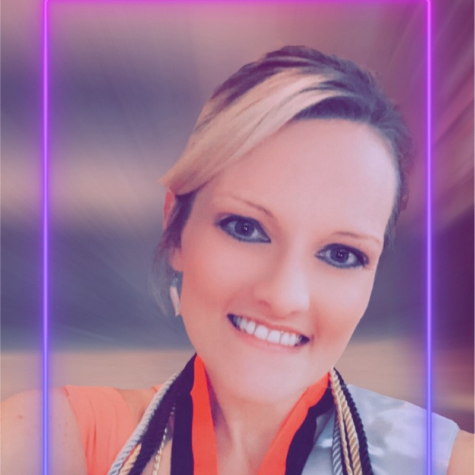

    

        <h1 style="text-align: center;">Tammy Hartline's E-Portfolio</h1>
    

        
        <h3 class="centered">Follow Me on LinkedIn!</h3>

    

    

    

        <a href="/">Home</a>
        <a href="/intro">About Me</a>
        <a href="/original-artifact-functionality">Original Artifacts</a>
        <a href="/enhancement-plan">Enhancement Plan</a>
        <a href="/software-engineering-and-design">Software Engineering</a>
        <a href="/algorithms-and-data-structures">Algorithms & Data Structures</a>
        <a href="/databases">Databases</a>
        <a href="/code-review">Code Review</a>
        <a href="/final-enhancements-review-summary">Enhancements Summary</a>
        <a href="/program_instructions">Run Instructions</a>
        <a href="/career-objective">Career Objective</a>
        <a href="/site-and-repo-links">Site & Repo Links</a>
    

# Internship Project

**Project Requirements:**
  - Create a plan and pitch for a conceptualized project/program/site/analysis that will help your community or a cause you are passionate about.
  - Await approval of your project.
  - Attend weekly leadership training sessions.
  - Learn SCRUM
  - Learn Agile Methodologies
  - Collaborate with your peers
  - Interview for desired roles, attend virtual hiring fairs
  - Create a fully functioning project within the given time frame
  - Present to stakeholders your completed product

Below is the PDF of my conceptualized project for the GWC, hosted by Raytheon Technologies (RTX) during the 2023 GWC Fall Leadership Internship/Fellowship.

<iframe src="/pitch.pdf" width="100%" height="600px"></iframe>
